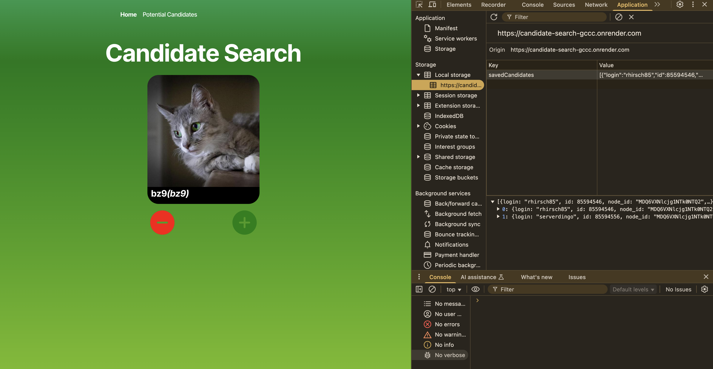

# Candidate Search

## Description 
An application that calls the GitHub API and renders data in the browser. 

## Technologies

* JavaScript
* TypeScript
* Node.js
* React

## Contribution 
XPert Learning Assistant, Stack Overflow Forums

## License
This project is licensed under the MIT License. 

## Links
[Live Site](https://candidate-search-gccc.onrender.com)

## Questions 
If you have any additional questions about the project, please feel free to raach me at: 
- GitHub [jaornelas](https://github.com/jaornelas)
- E-Mail [ornelalf001@gmail.com](mailto:ornelalf001@gmail.com)